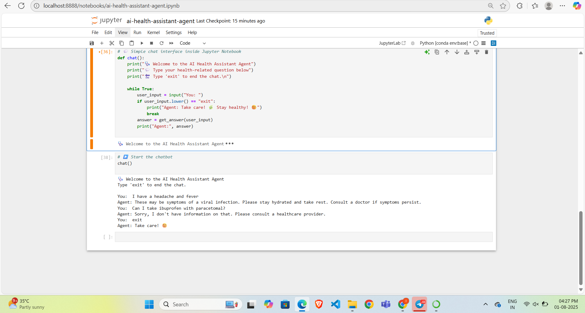

 PHASE 5: Add a README.md File
📍 Where: Inside your GitHub repo
🛠️ Steps:

Click on the README.md file (or create one)

Paste the following content:# 🧠 AI Health Assistant Agent

This chatbot is developed for the **IBM SkillsBuild Internship** using Python and Jupyter Notebook. It provides health-related information based on a mini knowledge base.

## ✅ Features
- Symptom checker
- Medicine advice
- Doctor suggestions
- Optional: Multilingual responses

## 🛠 Technologies
- Python 3
- Jupyter Notebook
- Googletrans (optional)
- IBM Watsonx (design reference)

## 💬 Sample Queries
- I have a headache and fever
- What are the symptoms of dengue?
- Can I take ibuprofen with paracetamol?

## 📸 Screenshot

## 🎓 IBM Certification

## 📁 Files Included
- `ai_health_assistant_agent.ipynb`
- `demo_screenshot.png`
- `ibm_certificate.png`

## 🔗 Project URL
https://github.com/T-Ishwarya/ai-health-assistant-agent.git
